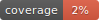

# {{cookiecutter.project_repository_name}}

## Project tools & prerequisities

For a detailed description of the tools that this project provides, read [/docs/project_tools.md](/docs/project_tools.md).

Installation instructions for these tools and other prerequisites can be found at [/docs/prerequisites_installation_instructions.md](/docs/prerequisites_installation_instructions.md).

## Initialise your project

Simply run `task initialise-project` to get started. For some more information regarding installation instructions, downloading data and using jupiter, please refer to [/docs/project_installation_instructions.md](/docs/project_installation_instructions.md).

<!---
It is advised to not adjust the text above, in order to make it easier to update this file when the project is updated according to the latest version of the project template.

Write your project-specific readme information below this comment. After updating, the previous text will be gone.
However, simply discard the Hunk deleting your text and it will be back.
-->

### Configuration

Be sure to:

- replace the default values where necessary in the [/{{cookiecutter.project_repository_name}}.env]({{cookiecutter.project_repository_name}}.env) file.

